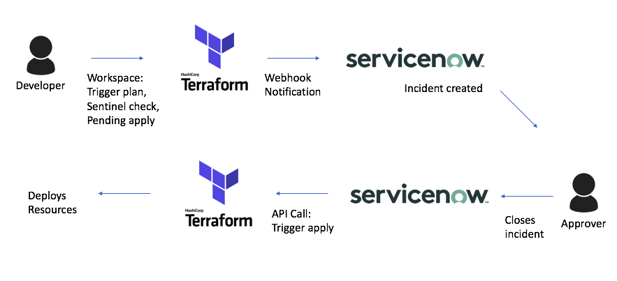
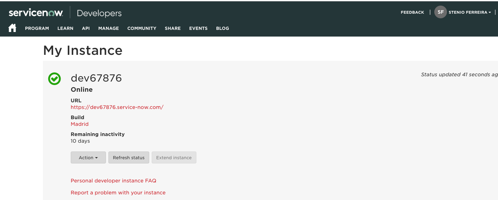
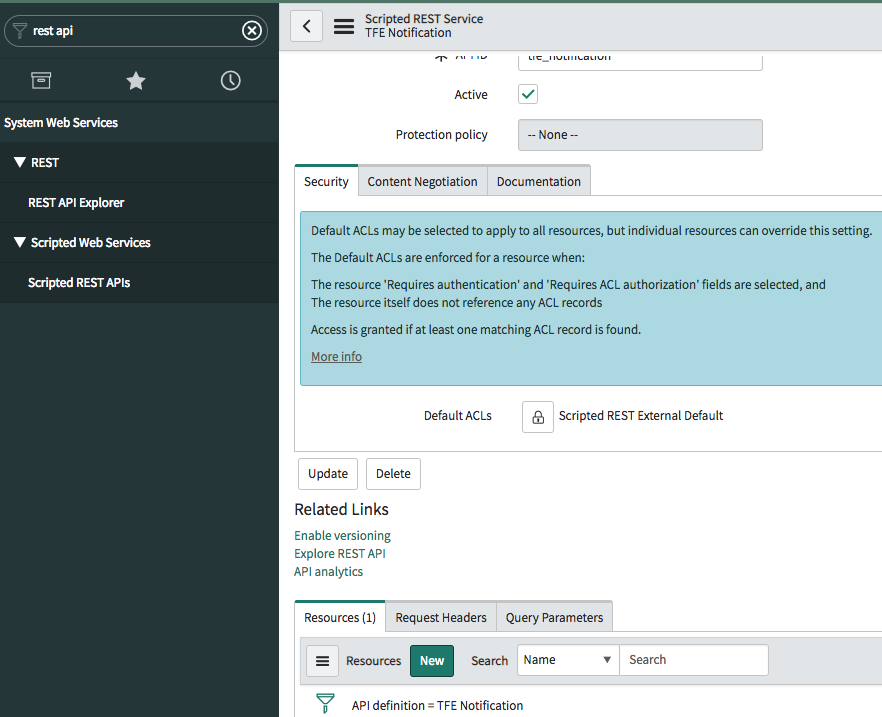
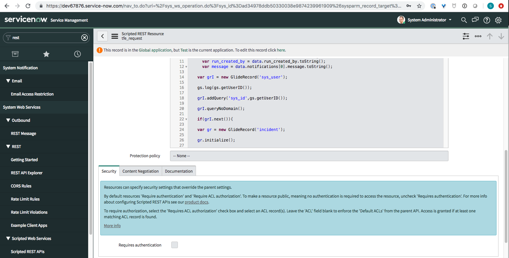
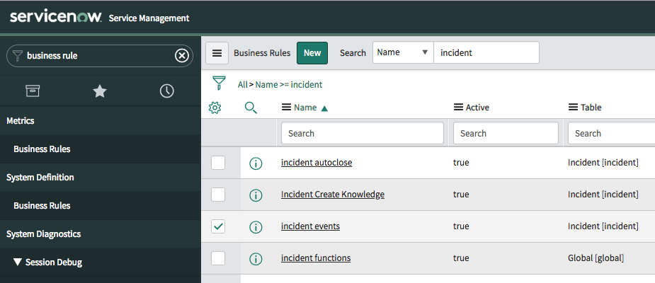
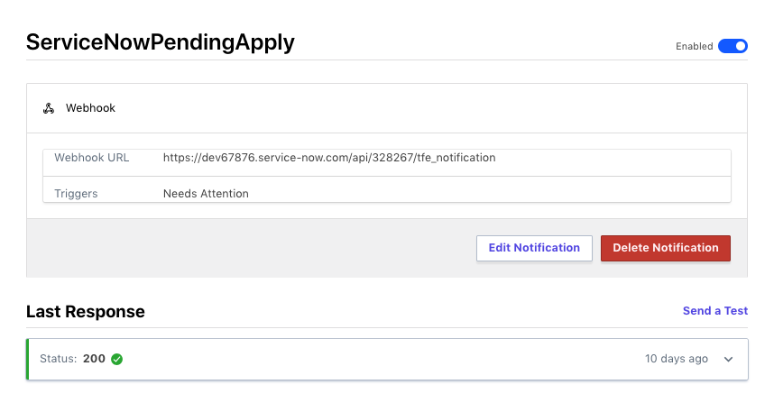

# Terraform Enterprise - ServiceNow Integration

This guide will show how to leverage Terraform Enterprise Notifications and the Terraform API to manage approval workflow using ServiceNow.

First you should sign up for ServiceNow developer program and create a dev instance, then we will configure Service Now to be ready to communicate with TFE, then we will create a TFE workspace hook to call ServiceNow.

## Workflow


## Requirements
- Terraform Enterprise credentials
- ServiceNow credentials and dev instance

### Create ServiceNow dev account
1. Go to https://developer.servicenow.com and signup
2. Create an instance using "Madrid" image
3. Your INSTANCE_ID can be found in the url or in your developer home:


## Create TFE API token to be used by ServiceNow
1. Go to Settings > API Tokens > "Create User API Token" > Enter name and save token in secure location

## Configuring ServiceNow API call to TFE
First, make sure you are logged in to ServiceNow dashboard
### Scripted Rest API
This is what will be listening for TFE notifications.
1. Go to "System Web Services > Scripted Web Services > Scripted REST APIs"
2. Click "New", enter "Name" and "API ID". These can be any value
3. Once created, open the script, scroll down and on Resources click "New"

4. Set HTTP Method to "POST", and enter the following script:
```
(function process(/*RESTAPIRequest*/ request, /*RESTAPIResponse*/ response) {
    var data = request.body.data;

	// Will only be triggered if it is a pending Terraform apply
    // Sample TFE payload: https://www.terraform.io/docs/enterprise/api/notification-configurations.html#sample-payload: 
    if (data.notifications[0].trigger == 'run:needs_attention') {
        var run_url = data.run_url.toString();
	    var run_id = data.run_id.toString();
	    var organization_name = data.organization_name.toString();
	    var workspace_name = data.workspace_name.toString();
	    var run_created_by = data.run_created_by.toString();
	    var message = data.notifications[0].message.toString();
	
        var grI = new GlideRecord('sys_user');

        gs.log(gs.getUserID());

        grI.addQuery('sys_id',gs.getUserID());

        grI.queryNoDomain();

        if(grI.next()){
            // Creates a new incident
            var gr = new GlideRecord('incident');
            gr.initialize();
            gr.setValue('category','TFE run');
            gr.setValue('subcategory','Confirm apply');
            gr.setValue('short_description','Confirm apply for ' + organization_name + '/' + workspace_name );

            // This will store the json object from Terraform in the description field
            var parser = new JSON(); 
            var str = parser.encode(data);
            gr.setValue('description', str );

            // Feel free to change per organization's needs
            gr.setValue('comments','Created by ' + run_created_by);
            gr.setValue('urgency','3');
            gr.setValue('impact','3');
            gr.setValue('caller_id','n/a');
            gr.setValue('contact_type','WebService');
            gr.setValue('company',grI.getValue('company'));
            gr.setValue('location',grI.getValue('location'));
            gr.setValue('caller_id',gs.getUserID());
            gr.sys_domain = gs.getUser().getDomainID();
            gr.insert();

            var number = gr.getValue('number');
            var state = gr.state;

            return {
                "incident_number":number,
                "state":state,
                "domain":gr.getDisplayValue('sys_domain')
            };
        }
	} else {
		gs.info("Received notification from Terraform, but it wasn't a pending apply");
		gs.info("Terraform request: " + request.body.data.toString());
	}
})(request, response);
```
5. Make sure you uncheck "Requires authentication" box (once again, this is not production-level code)


### Business Rules
1. Go to System Definitions > Business Rules
2. Search for "incidents"
3. Click on "incident.events". These are the commands that will be executed whenever there is a change to incidents.

4. Click on "Advanced", and add the following to the script
```
if (current.category == 'TFE run' && current.resolved_at != '') {
    gs.info("Preparing to send TFE API request");
	var requestBody;
    var responseBody;
    var status;
    try {
        // On the Scripted Rest API that receives TFE notification, we put the json data on the incident's description
        // In this block we will reverse that to a json object
        var parser = new JSON();
        var str = current.description;
        var obj = parser.decode(str);
        
        // Creates message
        var r = new sn_ws.RESTMessageV2();
		r.setEndpoint("https://app.terraform.io/api/v2/runs/" + obj.run_id + "/actions/apply");
		r.setHttpMethod("POST");
        // Make sure you update the TFE token
		r.setRequestHeader("Authorization", "Bearer "+ "YOUR_TFE_TOKEN_HERE");
		r.setRequestHeader('Content-Type', 'application/vnd.api+json');

        var response =	r.execute();
        responseBody = response.haveError() ? response.getErrorMessage() : response.getBody();
        status = response.getStatusCode();
    } catch(ex) {
        responseBody = ex.getMessage();
        status = '500';
    } finally {
        gs.info("API call to TFE was successful");
        requestBody = r ? r.getRequestBody():null;
    }
    gs.info("Request Body: " + requestBody);
    gs.info("Response: " + responseBody);
    gs.info("HTTP Status: " + status);
}
```

## Configuring TFE outbound notification
1. Log in to Terraform Enterprise, select a Workspace and go to Settings > Notifications
2. Select "Webhook", and paste the Rest API URL. It should follow the format:
```
https://YOUR_INSTANCE_ID.service-now.com/api/YOUR_API_ID/YOUR_ENDPOINT_NAME
```
3. Select which events to trigger, press ok
4. Make sure you enable the Terraform notification


## Validation
1. Triger a TFE run in the selected workspace
2. On ServiceNow, go to Service Desk > Incidents and see the incident created
3. Enter "Resolution notes" and "Resolution Code", and press "Resolve"
4. Go to "System Logs > System Log > All" and validate "API call to TFE was successful" message
